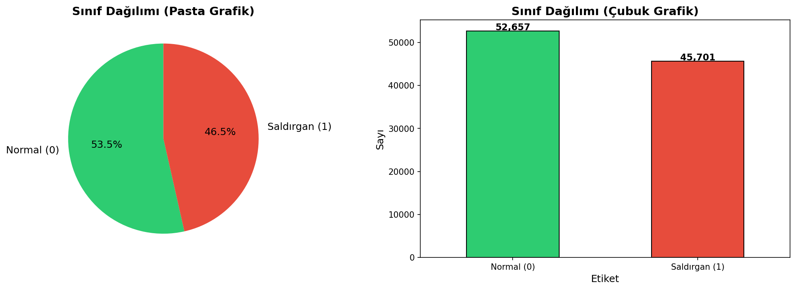
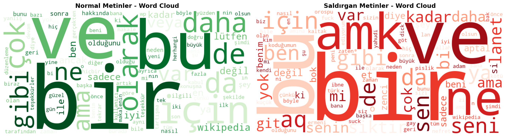

# 🛡️ Derin Öğrenme Yöntemleri ile Sosyal Medyada Saldırgan İçerik Tespiti

Türkçe sosyal medya metinlerinden saldırgan/toksik içerik tespiti için derin öğrenme modelleri.

## 📊 Proje Özeti

Bu projede Türkçe sosyal medya paylaşımlarının **saldırgan** veya **normal** olarak sınıflandırılması için 4 farklı derin öğrenme modeli eğitilmiştir:

| Model | Açıklama |
|-------|----------|
| **LSTM** | Long Short-Term Memory |
| **BiLSTM** | Bidirectional LSTM |
| **CNN** | 1D Convolutional Neural Network |
| **BERT** | Türkçe BERT (dbmdz/bert-base-turkish-cased) |

## 📁 Proje Yapısı

```
├── veri_setleri/                          # Temizlenmiş veri setleri
│   ├── train.csv                          # Eğitim seti (~73,768 satır)
│   ├── valid.csv                          # Doğrulama seti (~9,836 satır)
│   └── test.csv                           # Test seti (~14,754 satır)
│
├── veri_temizlemesi_ve_egitimi/            # Kaynak kodlar
│   ├── 01_veri_temizleme.py               # Veri temizleme & EDA pipeline'ı
│   └── 02_model_egitimi_colab.py          # Model eğitimi (Google Colab)
│
├── grafikler/                             # EDA grafikleri
│   ├── 01_sinif_dagilimi.png
│   ├── 02_metin_uzunlugu.png
│   ├── 03_kaynak_dagilimi.png
│   ├── 04_boxplot_uzunluk.png
│   ├── 05_wordcloud.png
│   ├── 06_en_sik_kelimeler.png
│   └── 07_split_dagilimi.png
│
└── README.md
```

## 📈 Veri Setleri

İki farklı Türkçe saldırgan içerik veri seti birleştirilerek kullanılmıştır:

| Kaynak | Satır Sayısı | Link |
|--------|-------------|------|
| HuggingFace (Overfit-GM) | ~77,800 | [turkish-toxic-language](https://huggingface.co/datasets/Overfit-GM/turkish-toxic-language) |
| Kaggle (toygarr) | ~53,000 | [turkish-offensive-language-detection](https://www.kaggle.com/datasets/toygarr/turkish-offensive-language-detection) |

**Temizleme sonrası:** 98,358 satır (Normal: %53.5, Saldırgan: %46.5)

### Sınıf Dağılımı


### Word Cloud


## 🚀 Google Colab'da Çalıştırma

### Adım 1: Colab'ı Açın
[](https://colab.research.google.com)

### Adım 2: GPU Etkinleştirin
`Runtime > Change runtime type > T4 GPU`

### Adım 3: Repo'yu Klonlayın
```python
!git clone https://github.com/KULLANICI_ADINIZ/saldirgan-icerik-tespiti.git
```

### Adım 4: Eğitim Scriptini Çalıştırın
```python
%run saldirgan-icerik-tespiti/veri_temizlemesi_ve_egitimi/02_model_egitimi_colab.py
```

## 🛠️ Gerekli Kütüphaneler

```
pandas
numpy
matplotlib
seaborn
scikit-learn
tensorflow
torch
transformers
wordcloud
```

## 📝 Lisans

Bu proje eğitim amaçlı geliştirilmiştir.
